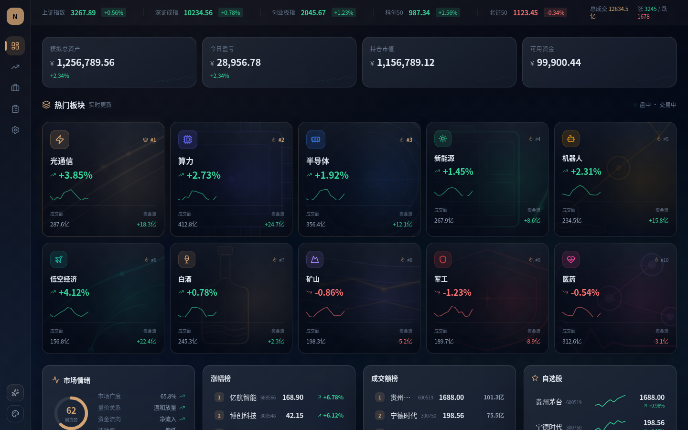
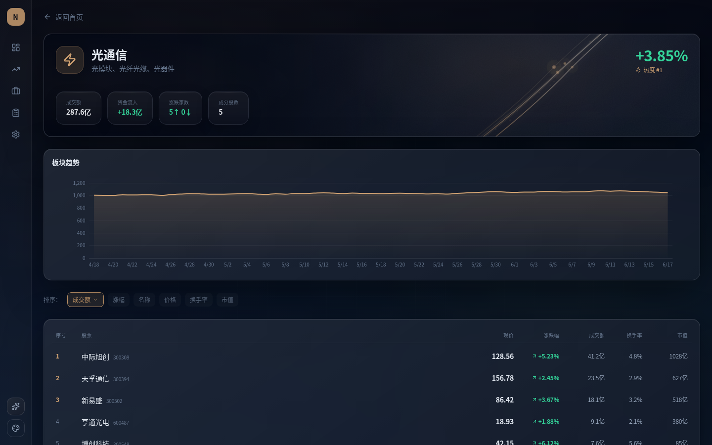
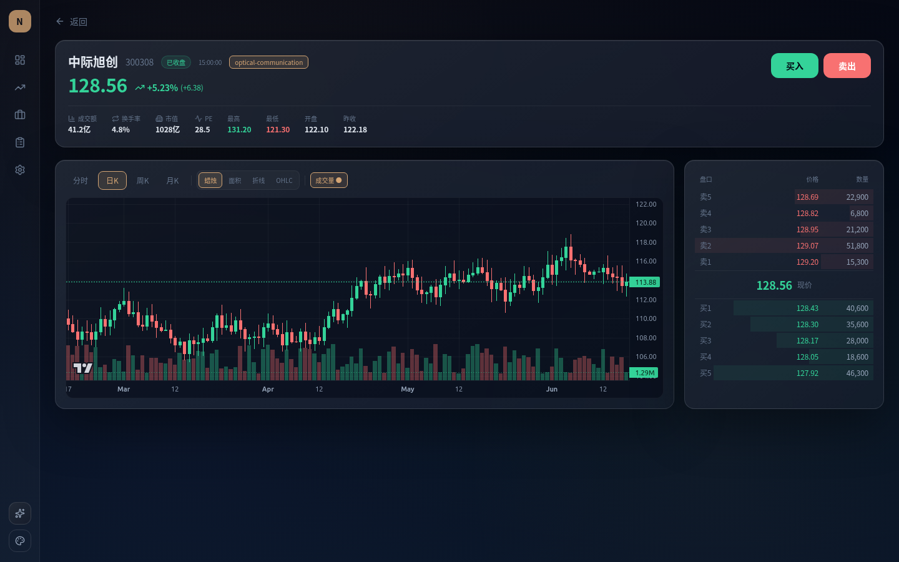
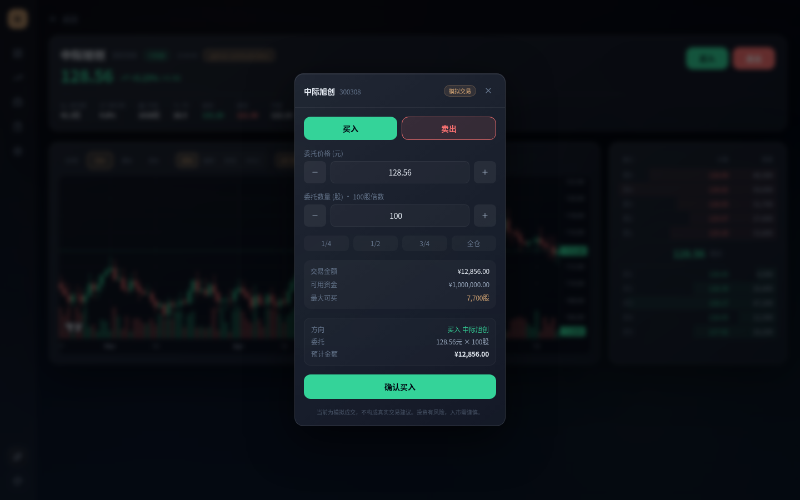
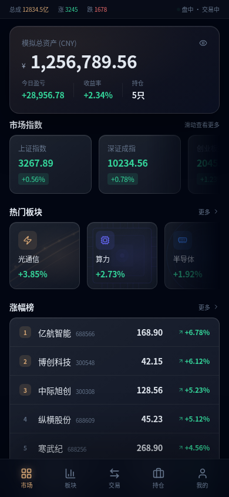
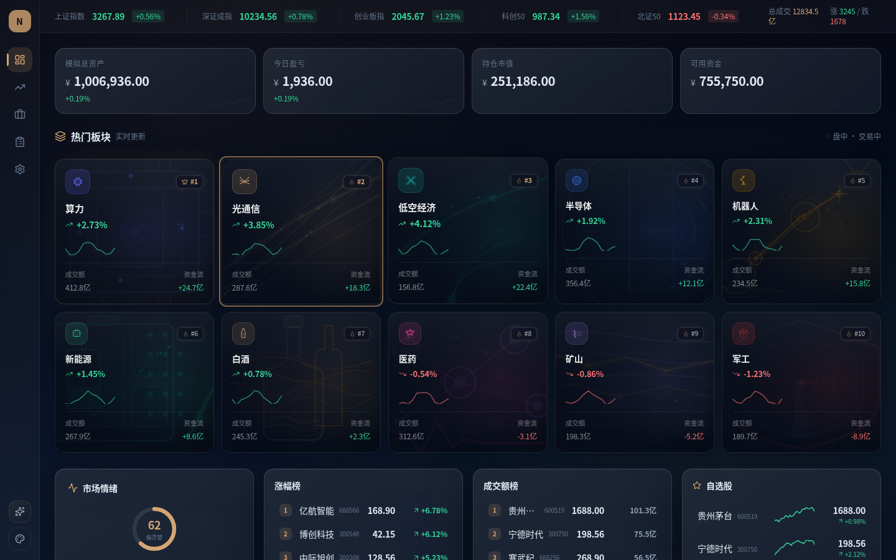

# NexusTrade — 高质感股票交易界面 Demo

> 暗色玻璃拟态 · 10 大行业板块 · K 线图表 · 模拟交易 · 移动端适配 · 交互动效系统

一个完整的股票交易界面原型，展示现代 Web 前端在金融科技场景下的视觉与交互能力。所有行情和交易数据均为模拟，不接入真实券商接口。

**🔗 Live Demo** · [Vercel (SSR)](https://stock-trading-demo.vercel.app) · [Cloudflare Pages (静态)](https://nexus-trade.pages.dev)

---

## 界面预览

| 桌面端首页 | 板块详情 |
|:---:|:---:|
|  |  |

| K 线图表 | 交易面板 |
|:---:|:---:|
|  |  |

| 移动端首页 | 光标交互动效 |
|:---:|:---:|
|  |  |

---

## 核心特性

### 🎨 视觉系统
- **东方暗金主题**：4 套可切换主题（暗金 / 赛博蓝紫 / 黑金机构 / 冰川玻璃）
- **玻璃拟态组件**：半透明渐变 + backdrop-filter + 微光边框
- **10 大行业板块**：光通信、算力、半导体、新能源、机器人、低空经济、白酒、矿业、军工、医药，每个板块独立程序化纹理
- **Canvas 行业卡片**：用 Canvas 2D 渲染带真实行业数据的视觉卡片

### 📈 交易功能
- **50+ 只模拟股票**：含价格、涨跌幅、成交额、换手率、市值、PE
- **K 线图表**：TradingView Lightweight Charts v5.2，支持蜡烛 / 面积 / 折线 / OHLC 四种图表
- **五档盘口**：实时模拟买卖五档挂单
- **交易面板**：买入 / 卖出、限价 / 市价、数量调节、模拟成交动画
- **订单记录**：完整订单生命周期，localStorage 持久化
- **持仓与资金流水**：交易联动账户系统，持仓成本、浮动盈亏、资金明细

### ✨ 交互体验
- **光标跟随光晕**：桌面端 220px 径向渐变跟随鼠标
- **磁性卡片**：hover 时 perspective 3D 倾斜效果
- **点击涟漪**：统一的 ClickRipple 反馈动画
- **Demo Mode**：引导式演示模式，高亮关键操作路径
- **行流动态**：表格行 hover 时 accent 边框渐变动画

### 📱 移动端
- **原生手机排版**：不是桌面端等比例压缩，sidebar 隐藏、2 列板块网格、交易页纵向堆叠
- **底部导航栏**：95% 不透明度 + backdrop-blur + 阴影
- **无水平溢出**：390×844 和 430×932 视口均通过 overflow 检测
- **触控适配**：光标动效和磁性效果在移动端自动禁用

---

## 技术栈

| 层级 | 技术 |
|------|------|
| 框架 | Next.js 14 (App Router) + React 18 + TypeScript |
| 样式 | Tailwind CSS 3.4+ |
| 动画 | Framer Motion 11+ |
| 图表 | TradingView Lightweight Charts v5.2 |
| 图标 | Lucide React |
| 状态管理 | React useState/useEffect + localStorage |
| 部署 | Vercel (SSR) + Cloudflare Pages (静态) |

---

## 快速开始

```bash
# 克隆
git clone https://github.com/christopher47634/nexus-trade-demo.git
cd nexus-trade-demo

# 安装依赖
npm install

# 构建 & 启动
npm run build
npx next start -p 3458
```

访问 `http://localhost:3458`

### 环境变量

| 变量 | 默认值 | 说明 |
|------|--------|------|
| `NEXT_PUBLIC_ENABLE_CANVAS_VISUALS` | `true` | 启用 Canvas 高级板块视觉，设为 `false` 回退到静态背景 |

---

## 项目结构

```
src/
├── app/                          # Next.js 路由页面
│   ├── page.tsx                  # 桌面首页
│   ├── portfolio/                # 持仓页
│   ├── orders/                   # 订单记录页
│   ├── settings/                 # 设置页（玻璃拟态 Demo）
│   ├── sectors/[sectorId]/       # 板块详情
│   ├── stocks/[stockCode]/       # 个股详情 + K 线 + 交易
│   └── mobile/                   # 移动端页面
├── components/
│   ├── common/                   # GlassCard / MetricCard / ThemeSwitcher
│   ├── layout/                   # DesktopShell / MobileShell
│   ├── market/                   # IndexTicker / HotSectorGrid / RankingList
│   ├── sector/                   # SectorVisualBackground / HeroKpiCard
│   ├── stock/                    # KlineChart / OrderBook / TradePanel
│   ├── portfolio/                # PositionTable / TransactionList
│   ├── demo/                     # DemoMode / DemoGuide
│   └── interaction/              # CursorOverlay / MagneticSurface / ClickRipple
├── mock/                         # 模拟数据（板块 / 个股 / K 线 / 指数 / 订单）
├── lib/                          # 交互 token / Canvas 渲染器 / 工具函数
└── styles/                       # 全局样式 + 主题系统
```

---

## 开发历程

这个项目经历了 7 个大版本迭代，从 P1 基础视觉到 P7 交互动效层：

| 阶段 | 内容 | Tag |
|------|------|-----|
| P1 | 暗金视觉系统 + 核心交易闭环 + Demo 包装 | `v1` 系列 |
| P2 | 板块 Canvas 视觉 + 身份墙 + 生产集成 | `v2` 系列 |
| P3 | 交互动效打磨 + 终端级视觉收尾 | `v3-c-terminal-visual-closeout` |
| P4 | 交易产品真实感 + 生产清理 | `v4-a` / `v4-b` |
| P5 | 只读账户体系 + 交易联动持仓 + Demo Mode 故事线升级 | `v5-a1` / `v5-a2` / `v5-a3` |
| P6 | 高级交互动效系统（光标、磁性、涟漪） | `v6-final-interaction-premium` |
| P7 | 光标跟随层 + 移动端原生布局重写 | `v7-a-advanced-cursor-interaction-layer` |

完整工作流复盘报告见 [`final-delivery/full-project-workflow-forensics/`](final-delivery/full-project-workflow-forensics/)。

---

## 注意事项

- 所有行情、订单、成交均为 **模拟数据**，不接真实券商接口
- 不构成任何投资建议
- 订单和持仓使用浏览器 localStorage 持久化，清除浏览器数据会丢失
- 涨跌配色：青绿涨 / 朱红跌

---

## License

[MIT](LICENSE)
